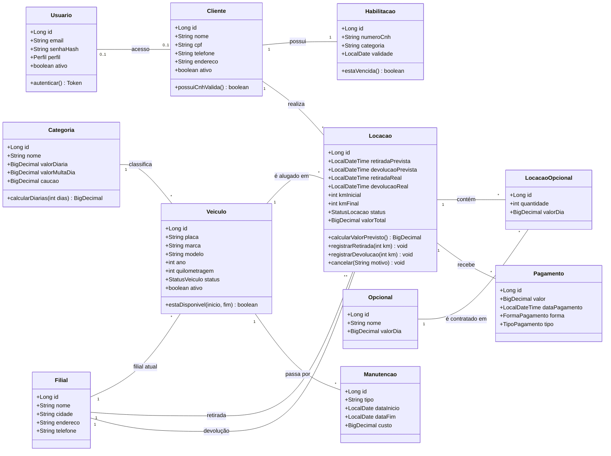

# LocaFácil — Sistema de Gestão de Aluguel de Veículos

Projeto Final da disciplina **Programação Web** (foco em Backend) — Centro Universitário Católica de Santa Catarina.
API REST em **Java + Spring Boot** para controlar frota, clientes, reservas, locações e pagamentos de uma locadora de carros.

> **Status:** Etapa 1 (requisitos, modelagem e camada de persistência) — entrega em **26/10/2026, 23h59**.
> Etapa 2 (6 pts) — 23/11 · Entrega final — 30/11.

## Equipe

| Integrante | Papel |
| --- | --- |
| Bruno Rovani | Desenvolvimento |
| Bruno Schimiguel | Desenvolvimento |
| Renan | Desenvolvimento |
| Tissi | Desenvolvimento |

> Líder do grupo (responsável pelo envio): _a definir_.

## Sumário

1. [Visão geral](#1-visão-geral)
2. [Tecnologias](#2-tecnologias)
3. [Requisitos funcionais](#3-requisitos-funcionais)
4. [Requisitos não funcionais](#4-requisitos-não-funcionais)
5. [Modelo de dados e diagrama de classes](#5-modelo-de-dados-e-diagrama-de-classes)
6. [Dicionário de dados](#6-dicionário-de-dados)
7. [Matriz de rastreabilidade (RF × endpoints × entidades)](#7-matriz-de-rastreabilidade)
8. [Regras de negócio](#8-regras-de-negócio)
9. [Estrutura do projeto](#9-estrutura-do-projeto)
10. [Como executar](#10-como-executar)
11. [Cronograma e escopo das etapas](#11-cronograma-e-escopo-das-etapas)

---

## 1. Visão geral

### 1.1 Problema e justificativa

Locadoras de pequeno e médio porte ainda controlam reservas e frota em planilhas e mensagens, o que gera conflito de agenda (o mesmo carro reservado duas vezes), cobrança errada de diárias e multas, e falta de histórico por cliente e por veículo.

O LocaFácil centraliza esses dados em uma base única e aplica as regras de negócio de forma automática: bloqueia reservas sobrepostas, valida a CNH do condutor, calcula o valor da locação e registra pagamentos.

### 1.2 Público-alvo

Atendentes e gerentes de locadoras (uso interno), administradores do sistema e clientes pessoa física que reservam veículos.

### 1.3 Objetivos

- Manter o cadastro de clientes, habilitações, veículos, categorias e filiais.
- Garantir a disponibilidade correta dos veículos por período (reservas, locações ativas e manutenções).
- Calcular o valor total (diárias, opcionais e multa por atraso) e controlar pagamentos.
- Expor uma API REST documentada e protegida, com perfis `ADMIN`, `ATENDENTE` e `CLIENTE`.
- Persistir com JPA/Hibernate, com mais de 5 entidades e relacionamentos 1:1, 1:N e N:M.

## 2. Tecnologias

| Camada | Tecnologia |
| --- | --- |
| Linguagem | Java 17 |
| Framework | Spring Boot 3.x (Web, Data JPA, Validation, Security) |
| Persistência | JPA / Hibernate, Spring Data JPA (`JpaRepository`) |
| Banco de dados | PostgreSQL (execução) · H2 em memória (testes) |
| Autenticação | JWT (stateless), senhas com BCrypt |
| Documentação da API | OpenAPI / Swagger (springdoc) |
| Testes | JUnit 5, Mockito, `@DataJpaTest` |
| Build | Maven |

## 3. Requisitos funcionais

| Código | Requisito | Descrição | Perfil |
| --- | --- | --- | --- |
| RF01 | Autenticação de usuários | Login com e-mail e senha, retorna token JWT com expiração. Todas as rotas, exceto login e cadastro de cliente, exigem token. | Todos |
| RF02 | Gerenciamento de usuários | CRUD de usuários, desativação e troca de perfil. E-mail único e senha com hash. | ADMIN |
| RF03 | Cadastro de clientes e habilitação | CRUD de clientes (nome, CPF único, telefone, endereço), cada um com uma habilitação (CNH, categoria, validade). Autocadastro permitido. | ADMIN, ATENDENTE, CLIENTE |
| RF04 | Gerenciamento de categorias | CRUD de categorias (Econômico, SUV, Executivo) com diária, multa por dia de atraso e caução. | ADMIN |
| RF05 | Gerenciamento de filiais | CRUD de filiais. Não pode remover filial com veículos ou locações associados. | ADMIN |
| RF06 | Gerenciamento de veículos | CRUD de veículos (placa única, marca, modelo, ano, quilometragem, status) ligados a uma categoria e a uma filial. | ADMIN, ATENDENTE |
| RF07 | Consulta de disponibilidade | Lista paginada de veículos disponíveis em um período, com filtros por filial, categoria e preço. | Todos |
| RF08 | Gerenciamento de opcionais | CRUD de opcionais (GPS, cadeirinha, seguro adicional) com valor por dia. | ADMIN |
| RF09 | Criação de reserva | Cria locação `RESERVADA` validando disponibilidade e CNH, com opcionais e valor previsto. | ADMIN, ATENDENTE, CLIENTE |
| RF10 | Retirada do veículo | Registra km inicial e data/hora real; locação vira `ATIVA` e veículo `ALUGADO`. | ADMIN, ATENDENTE |
| RF11 | Devolução do veículo | Registra km final e data/hora real, calcula multa por atraso e valor final; locação vira `FINALIZADA`. | ADMIN, ATENDENTE |
| RF12 | Cancelamento de reserva | Cancela locação ainda `RESERVADA`, com motivo, liberando o período. | ADMIN, ATENDENTE, CLIENTE |
| RF13 | Registro de pagamentos | Registra sinal, saldo ou multa (PIX, cartão, dinheiro) e informa o saldo devedor. | ADMIN, ATENDENTE |
| RF14 | Gerenciamento de manutenções | Registra manutenções com período, tipo e custo; veículo fica indisponível no período. | ADMIN, ATENDENTE |
| RF15 | Histórico e consultas | Lista locações por cliente, veículo, filial, status e período; histórico de veículo. Cliente vê só as próprias. | ADMIN, ATENDENTE, CLIENTE |

## 4. Requisitos não funcionais

| Código | Categoria | Requisito |
| --- | --- | --- |
| RNF01 | Tecnologia | Java 17, Spring Boot 3.x, Maven, código versionado em Git. |
| RNF02 | Arquitetura | Camadas `controller`, `service`, `repository`, `entity`, `dto`. Entidades JPA não são expostas na API (uso de DTOs). |
| RNF03 | Banco de dados | JPA/Hibernate; PostgreSQL em execução e H2 nos testes; chaves primárias/estrangeiras e unicidade (CPF, placa, e-mail). |
| RNF04 | Banco de dados | Operações multi-tabela em uma única transação (`@Transactional`); `BigDecimal` para dinheiro; `LocalDate`/`LocalDateTime` para datas. |
| RNF05 | Segurança | JWT stateless com autorização por perfil; 401 sem token, 403 sem permissão. |
| RNF06 | Segurança | Senhas com BCrypt; segredos (chave JWT, credenciais do banco) via variáveis de ambiente. |
| RNF07 | Validação | Bean Validation com resposta 400 por campo; `@RestControllerAdvice` global com corpo de erro padronizado. |
| RNF08 | REST | Recursos no plural (`/clientes`, `/veiculos`, `/locacoes`), verbos HTTP corretos, JSON e status 200/201/204/400/401/403/404/409. |
| RNF09 | Desempenho | Listagens paginadas (`Pageable`); `JOIN FETCH`/`@EntityGraph` para evitar N+1; leitura simples em até 500 ms com 10 mil veículos. |
| RNF10 | Documentação | Swagger UI em `/swagger-ui.html` e este README. |
| RNF11 | Qualidade | Testes unitários (JUnit 5/Mockito) das regras críticas e `@DataJpaTest` nas consultas. |
| RNF12 | Integridade | Exclusão lógica (`ativo`) para clientes, usuários e veículos com histórico. |

## 5. Modelo de dados e diagrama de classes

O diagrama abaixo é renderizado automaticamente pelo GitHub (Mermaid).



**Relacionamentos e mapeamento JPA**

| Relacionamento | Tipo | Anotações JPA |
| --- | --- | --- |
| Cliente — Habilitacao | 1:1 | `@OneToOne(cascade = ALL, orphanRemoval = true)` em `Cliente` |
| Usuario — Cliente | 1:1 (opcional) | `@OneToOne` em `Cliente` (lado dono, `usuario_id`) |
| Cliente — Locacao | 1:N | `@ManyToOne` em `Locacao` / `@OneToMany(mappedBy = "cliente")` em `Cliente` |
| Veiculo — Locacao | 1:N | `@ManyToOne` em `Locacao` |
| Categoria — Veiculo | 1:N | `@ManyToOne` em `Veiculo` |
| Filial — Veiculo | 1:N | `@ManyToOne` em `Veiculo` |
| Filial — Locacao (retirada e devolução) | 1:N (duas associações) | dois `@ManyToOne` em `Locacao`: `filialRetirada` e `filialDevolucao` |
| Locacao — Opcional | N:M | tabela associativa `LocacaoOpcional` (com `quantidade` e `valorDia`), via dois `@ManyToOne` |
| Locacao — Pagamento | 1:N | `@ManyToOne` em `Pagamento` |
| Veiculo — Manutencao | 1:N | `@ManyToOne` em `Manutencao` |

> A relação N:M entre `Locacao` e `Opcional` é modelada como entidade associativa porque guarda atributos próprios (quantidade e valor cobrado por dia).

## 6. Dicionário de dados

| Entidade (tabela) | Campo | Tipo | Restrições |
| --- | --- | --- | --- |
| Usuario (`usuarios`) | id | Long | PK, auto incremento |
| | email | String(120) | único, não nulo |
| | senhaHash | String(100) | não nulo (BCrypt) |
| | perfil | Enum `Perfil` | `ADMIN`, `ATENDENTE`, `CLIENTE` |
| | ativo | boolean | padrão `true` |
| Cliente (`clientes`) | id | Long | PK |
| | nome | String(120) | não nulo |
| | cpf | String(11) | único, não nulo |
| | telefone | String(20) | |
| | endereco | String(200) | |
| | ativo | boolean | padrão `true` |
| | habilitacao_id | Long | FK → `habilitacoes`, único |
| | usuario_id | Long | FK → `usuarios`, único, opcional |
| Habilitacao (`habilitacoes`) | id | Long | PK |
| | numeroCnh | String(20) | único, não nulo |
| | categoria | String(3) | não nulo (A, B, AB…) |
| | validade | LocalDate | não nulo |
| Categoria (`categorias`) | id | Long | PK |
| | nome | String(60) | único, não nulo |
| | valorDiaria | BigDecimal(10,2) | > 0 |
| | valorMultaDia | BigDecimal(10,2) | ≥ 0 |
| | caucao | BigDecimal(10,2) | ≥ 0 |
| Filial (`filiais`) | id | Long | PK |
| | nome | String(80) | não nulo |
| | cidade | String(80) | não nulo |
| | endereco | String(200) | |
| | telefone | String(20) | |
| Veiculo (`veiculos`) | id | Long | PK |
| | placa | String(8) | única, não nula |
| | marca / modelo | String(60) | não nulos |
| | ano | int | não nulo |
| | quilometragem | int | ≥ 0 |
| | status | Enum `StatusVeiculo` | `DISPONIVEL`, `ALUGADO`, `EM_MANUTENCAO` |
| | ativo | boolean | padrão `true` |
| | categoria_id / filial_id | Long | FK → `categorias` / `filiais` |
| Opcional (`opcionais`) | id | Long | PK |
| | nome | String(60) | único, não nulo |
| | valorDia | BigDecimal(10,2) | ≥ 0 |
| Locacao (`locacoes`) | id | Long | PK |
| | retiradaPrevista / devolucaoPrevista | LocalDateTime | não nulos; devolução > retirada |
| | retiradaReal / devolucaoReal | LocalDateTime | preenchidos na retirada/devolução |
| | kmInicial / kmFinal | int | km final ≥ km inicial |
| | status | Enum `StatusLocacao` | `RESERVADA`, `ATIVA`, `FINALIZADA`, `CANCELADA` |
| | valorTotal | BigDecimal(10,2) | calculado |
| | motivoCancelamento | String(200) | opcional |
| | cliente_id / veiculo_id | Long | FK, não nulas |
| | filial_retirada_id / filial_devolucao_id | Long | FK → `filiais` |
| LocacaoOpcional (`locacao_opcionais`) | id | Long | PK |
| | quantidade | int | ≥ 1 |
| | valorDia | BigDecimal(10,2) | valor cobrado no ato |
| | locacao_id / opcional_id | Long | FK; par único |
| Pagamento (`pagamentos`) | id | Long | PK |
| | valor | BigDecimal(10,2) | > 0 |
| | dataPagamento | LocalDateTime | não nulo |
| | forma | Enum `FormaPagamento` | `PIX`, `CARTAO`, `DINHEIRO` |
| | tipo | Enum `TipoPagamento` | `SINAL`, `SALDO`, `MULTA` |
| | locacao_id | Long | FK, não nula |
| Manutencao (`manutencoes`) | id | Long | PK |
| | tipo | String(60) | não nulo |
| | dataInicio / dataFim | LocalDate | fim ≥ início |
| | custo | BigDecimal(10,2) | ≥ 0 |
| | veiculo_id | Long | FK, não nula |

## 7. Matriz de rastreabilidade

| RF | Endpoints REST | Entidades envolvidas |
| --- | --- | --- |
| RF01 | `POST /auth/login` | Usuario |
| RF02 | `GET /usuarios`, `GET /usuarios/{id}`, `POST /usuarios`, `PUT /usuarios/{id}`, `PATCH /usuarios/{id}/status` | Usuario |
| RF03 | `POST /clientes`, `GET /clientes`, `GET /clientes/{id}`, `PUT /clientes/{id}`, `DELETE /clientes/{id}`, `PUT /clientes/{id}/habilitacao` | Cliente, Habilitacao, Usuario |
| RF04 | `GET/POST /categorias`, `GET/PUT/DELETE /categorias/{id}` | Categoria |
| RF05 | `GET/POST /filiais`, `GET/PUT/DELETE /filiais/{id}` | Filial |
| RF06 | `GET/POST /veiculos`, `GET/PUT/DELETE /veiculos/{id}` | Veiculo, Categoria, Filial |
| RF07 | `GET /veiculos/disponiveis?inicio=&fim=&filialId=&categoriaId=` | Veiculo, Categoria, Filial, Locacao, Manutencao |
| RF08 | `GET/POST /opcionais`, `GET/PUT/DELETE /opcionais/{id}` | Opcional |
| RF09 | `POST /locacoes` | Locacao, LocacaoOpcional, Opcional, Cliente, Habilitacao, Veiculo, Categoria, Filial |
| RF10 | `PATCH /locacoes/{id}/retirada` | Locacao, Veiculo |
| RF11 | `PATCH /locacoes/{id}/devolucao` | Locacao, Veiculo, Filial, Categoria |
| RF12 | `PATCH /locacoes/{id}/cancelamento` | Locacao, Veiculo |
| RF13 | `POST /locacoes/{id}/pagamentos`, `GET /locacoes/{id}/pagamentos` | Pagamento, Locacao |
| RF14 | `GET/POST /manutencoes`, `PUT/DELETE /manutencoes/{id}` | Manutencao, Veiculo |
| RF15 | `GET /locacoes?clienteId=&veiculoId=&filialId=&status=`, `GET /locacoes/{id}`, `GET /veiculos/{id}/historico`, `GET /clientes/{id}/locacoes` | Locacao, Cliente, Veiculo, Manutencao |

## 8. Regras de negócio

- **RN01** — Um veículo não pode ter duas locações (`RESERVADA` ou `ATIVA`) nem manutenção em períodos que se sobrepõem.
- **RN02** — Não é possível reservar com CNH vencida na data de devolução prevista.
- **RN03** — Valor previsto = diárias da categoria × dias + soma dos opcionais (valor/dia × quantidade × dias).
- **RN04** — Na devolução, atraso gera multa = dias de atraso × `valorMultaDia` da categoria.
- **RN05** — Transições de status válidas: `RESERVADA → ATIVA → FINALIZADA`; `RESERVADA → CANCELADA`.
- **RN06** — Soma dos pagamentos não pode ultrapassar o valor da locação; o saldo devedor é informado na consulta.
- **RN07** — Clientes só enxergam as próprias locações.

## 9. Estrutura do projeto

> Estrutura planejada; será preenchida conforme o código for adicionado.

```
projeto_web/
├── pom.xml
├── README.md
└── src/
    ├── main/
    │   ├── java/br/edu/catolicasc/locafacil/
    │   │   ├── LocaFacilApplication.java
    │   │   ├── config/          # segurança, JWT, OpenAPI
    │   │   ├── controller/
    │   │   ├── dto/
    │   │   ├── entity/          # @Entity (11 classes) e enums
    │   │   ├── exception/       # @RestControllerAdvice
    │   │   ├── repository/      # JpaRepository
    │   │   └── service/
    │   └── resources/
    │       └── application.properties
    └── test/java/...
```

## 10. Como executar

Pré-requisitos: **JDK 17**, **Maven 3.9+** e **PostgreSQL 14+** (ou usar o perfil de testes com H2).

```bash
# 1. clonar
git clone https://github.com/brunow27/projeto_web.git
cd projeto_web

# 2. variáveis de ambiente
export DB_URL=jdbc:postgresql://localhost:5432/locafacil
export DB_USER=postgres
export DB_PASSWORD=postgres
export JWT_SECRET=troque-por-uma-chave-longa-e-secreta

# 3. executar
./mvnw spring-boot:run

# 4. testes
./mvnw test
```

Com a aplicação no ar: API em `http://localhost:8080` e documentação em `http://localhost:8080/swagger-ui.html`.

## 11. Cronograma e escopo das etapas

| Data | Marco |
| --- | --- |
| 26/10 | **Etapa 1** (4 pts): documento de concepção e requisitos, diagrama de classes UML, 5+ entidades JPA, repositórios Spring Data |
| 16/11 | N2 |
| 23/11 | **Etapa 2** (6 pts) |
| 30/11 | Entrega final |
| 07/12 | N-1 |
| 14/12 | Resultado final |

**Checklist da Etapa 1**

- [ ] Documento de concepção e requisitos (seções 1 a 3 do template)
- [ ] Diagrama de classes UML com tipos, métodos, relacionamentos e cardinalidades
- [ ] Mínimo de 5 entidades `@Entity` com relacionamentos mapeados
- [ ] Repositórios `JpaRepository`
- [ ] Matriz de rastreabilidade RF × endpoints × entidades
- [ ] Link do repositório e identificação da equipe enviados pelo líder
